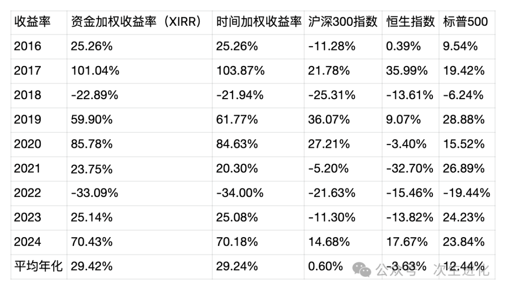
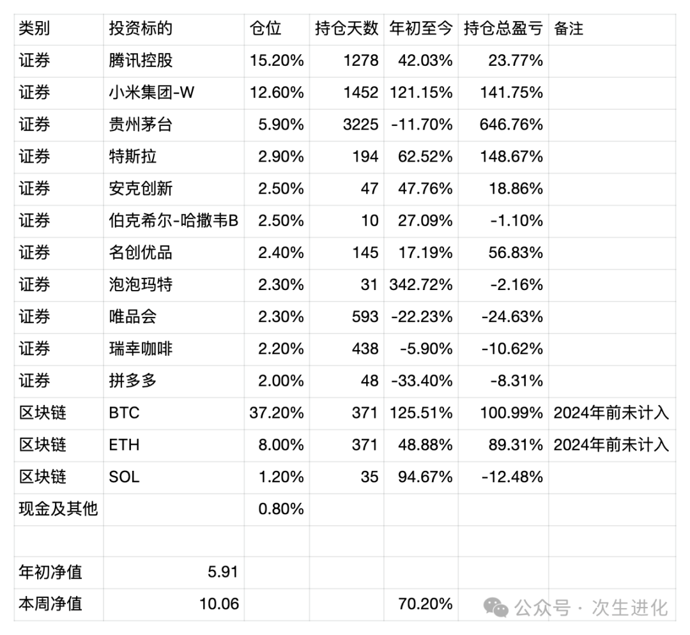
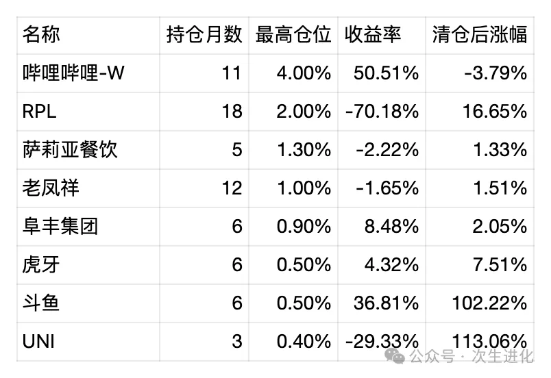

# 

# 买股票的三层逻辑——朝闻道家庭投资基金2024年年报

昨天写日期年份，不小心写成了2015年，2015恍如昨日，一个笔误就是十年。公历新年之交，在医院陪护家人，这是一份迟些的年报。

2024年在老婆的强烈鼓励下，将自己80%的工作时间投入到了投资上，2024年取得了不错的收益，但是很难说投入更多的时间和更好的收益有什么直接的因果关系，这是投资最让人无奈也最有趣的一个地方。

2023年底基金净值5.91,2024年底基金净值10.06,2024年收益率约70%，9年年化收益率29%，提前一年完成了十年十倍的收益。从收益率来讲，在所有的年份中只能排第三，但绝对收益则是最丰盛的一年，这也就是滚雪球的魅力。

最新持仓情况 统计时间 20241231

对当前的持仓做一个简单的扫描。

1. 腾讯控股：证券类的第一大持仓，2024年有不错的涨幅，拉长到整个投资周期看，其实是一个很一般的投资，但是过往不咎，面向未来看，预期10%的年化收益应该还是没问题的，作为投资组合的压舱石，有稳定的利润，有慷慨的回购，还有视频号、电商，AI等潜在增长点，或许仍有超额收益的可能；
2. 小米集团：小米我从三年前的29.8港币高位开始建仓，一路最低买到8块多港币，这个过程说一点都不难受是假的，在手机高端化进展一般的情况下，雷军又宣布要造车，那时候真的没有多少人和资金看好，我当时的思考是，如果小米汽车单独做一家公司，我做风险投资，愿不愿意参股，结论是我愿意在雷军身上赌一把。2024年是小米高歌猛进丰收的一年，汽车业务从ppt变成了极大概率赚大钱，其实现在的高股价，某种意义上可以说比两三年的低股价反而风险更低，至少对很多大资金而言是这样，2024年出于自己需求卖出了少量小米，但这个持仓的大部分应该会持有到三线城市都遍地可见小米汽车的那天。
3. 贵州茅台：2024年依然是糟糕的一年，出于惯性和情怀一直持有，最近几年一直跌仓位也一直被动下降，只是抛掉沉没成本来看，当前的价格和股息率拿着没什么问题，毕竟我的投资预期收益率也才10%，以茅台当前的增长率和分红力度，看起来问题不大，按照去年算的，如果跌破1200，可以考虑加仓。
4. 特斯拉：买特斯拉其实不是买汽车业务，单以汽车而言，不值这么多钱，买的还是马斯克画的大饼，自动驾驶乃至人形机器人，小仓位的投入在短时间内翻倍了，中间有小额减仓，后续可能会继续小额减仓，但是直到看到马斯克的星辰大海落地的那一天。
5. 安克创新：2024年底新买入的股票，安克是出海企业中的佼佼者，也是出海企业中少有的在A股上市的，看过阳萌很多访谈，感觉是一个年轻版迷你版的雷军，企业家的当打之年，配合上中国产能与技术的红利，未来依然有很多的可能性。类似充电宝这样的浅海，固然竞争也很激烈，但是也是小米这样的巨头不会做透的市场，会给类似安克这样的企业很好的生存机会，能把充电宝做到果里果气，建立溢价，这是一种很难得的本事。
6. 伯克希尔-哈撒韦：2024年年底买入，因为有一笔钱想买美股，但实在不知道买什么好，关注了很多标的都感觉估值太高，巴菲特持有的现金越来越多，自己看不明白的时候，让大师帮忙管着钱似乎是个不错的选择，如果未来美股崩盘，有捡钱的机会，自己又看不懂，祖师爷会出手的，当然，如果自己看到比较确定的投资机会，会卖出伯克希尔-哈撒韦的，自己下场还是更有意思。
7. 名创优品：因为名创优品的总部就在广州，所以每周逛商场的过程中，老婆孩子对这家企业给了我持续的感性反馈，从最早的十元店到现在的IP联名，当我网购口罩1毛钱一个，而名创优品的货架上还卖着一两块一个的漂亮口罩时，我渐渐下定了持仓的决心。叶国富是一个有一些野路子的企业家，和他合伙风险确实不小，但在这个零售行业风起云涌的时代，传统超市纷纷倒闭，美式超市小范围火爆，胖东来火爆，在这种时候，也许野路子的叶国富是新的答案也未为可知，这笔持仓会至少大部分持有到叶国富完成永辉超市的整合。
8. 泡泡玛特：泡泡玛特的买入有点冲动，需要做好腰斩的准备，毕竟是在2024年涨了3倍多的前提下买入的。早在年初就关注了这家企业，但是当时更能看懂也更看好名创优品。这也提醒我如果一个领域内有双雄看不清楚时，不妨都买一点，成年人不做选择。年底的时候在家人买了一些泡泡玛特的玩偶，自己又读完了王宁的传记的情况下，激情下单了。我理解它目前是潮玩领域的唯一巨头，也许是中国未来的迪斯尼，仍有十倍空间。 这家企业也在我买出海的思路之中，而且是最有趣的一家，一个中国企业，对其他国家进行了文化输出，按现在的话讲，也是一种新质生产力。
9. 唯品会：2024年增长乏力，股价裹足不前，它的仓位在这一年中我是不断卖出的，转移到了一些感觉更有机会的地方，比如股价一直跌的拼多多。美国市场对中概股真的很严苛，尤其是唯品会这种没有增长的企业，几乎是按烟蒂来估值的，持有一年多，虽然也没有大亏，但付出了巨大的时间成本。
10. 瑞幸咖啡：看公司基本面高歌猛进，就是我还没赚到钱，买得太贵就会付出时间成本，好公司最终是会让人赚到钱。但是多少钱算贵，多少钱算便宜，是一个技术问题更是一个艺术问题。2024年过完，瑞幸的竞争态势是变好的，身边明显有更多门店了，有一种低头不见抬头见的感觉，联名和研发新品的能力依然在线，贴身缠斗的库迪也半死不活了，至于增长点，在消费复苏，在出海，而估值的爆发点，在于何时能从粉单市场回归。在经营态势无恶化的前提下，期待至少持仓到解决上市问题。
11. 拼多多：这家公司我看起来有一种略显奇特的美感，从购物审美上来说，我更喜欢京东，但是我相信有更多的人会喜欢拼多多，它更加极致，比如它没有购物车，好评返现直接做到了评价入口，只要确认收货就弹出摄像头让你拍照发评论，甚至包括是头部app里面少有的不放高利贷的，它只想把购物这件事情极致化、游戏化。从估值来说，或许阿里也很有吸引力，但从公司文化上来讲，作为投资人我更看好和喜欢拼多多。
12. BTC：持仓基石，也是2024年收益最大的贡献者，2024年底还使用ETH换仓了少量的BTC。从2024年初相关ETF在美国通过，到年底特朗普的胜选，BTC总市值超过白银。当BTC越来越进入主流视野时，其实风险是相对变小了。后续继续看好其达到黄金的地位，仍有至少10倍空间，不过在这个过程中我还是会控制仓位，永远没有必要去挣最后一个铜板。
13. ETH：ETH的投资总体来说是比较失败的，虽然相比法币浮盈不少，但相比BTC本位是亏损的，BTC的地位日益稳固，而ETH则无法成为区块链应用的霸主，受到了SOL甚至BTC的挑战，在这个过程中我对它的信心是越来越不足的，也许后续会继续减仓。
14. SOL：作为ETH最大的挑战者，我用部分ETH置换了SOL，也许最终是一笔失败的投资，但是如果投资ETH，确实不想承担ETH被取代的风险，SOL的市值对比ETH，从2024年初的六分之一涨到了四分之一。后续会对其和ETH一并考虑，调整仓位。

2024年也清仓了不少投资品种，也简单扫描一下，吸取教训。

1. 哔哩哔哩：这是下定了最大决心清仓的品种，因为仓位还比较高。整个交易过程回顾下来更像是对短期股价的投机，在暴涨了一波股价又大幅回调后，越来越发现自己信心不足，作为B站的用户，无论是乐趣还是知识都受益良多，虽然B站没有贴片广告，但是其他牛皮癣广告和植入式广告其实已经很多，但即使如此也不怎么赚钱，利润转正还要靠游戏，但是我买入的时候想的不是要买入一家游戏公司。也许B站这么多年的社会效益还是不错的，但真的不是一家好的商业公司，就像豆瓣一样。
2. RPL：这一年多来最失败的一笔投资，参与ETH质押挖矿而稀里糊涂买入的资产，结果ETH的收益还抵不上RPL的巨大跌幅，在刚开始质押的时候就感受到这个东西巨大的不确定性，但是被沉没成本所蒙蔽，一直持有，到年底终于承认错误清仓出局。这么多年来的一个教训就是，与其冒冒失失去做一些重资产的投资，不如想清楚一些更加基本的问题，赚黄金价格上涨的钱而不是去做辛苦挖矿的工作。
3. 萨莉亚餐饮：孩子爱吃莎莉亚，做了一些财务分析，然后买入。最终小亏清仓。最初的买入逻辑在于它的价格不贵，而且有继续扩张的潜力。持有大约半年的感受是，日本人现在做生意太过保守，动作太慢，它的竞争优势不排除被必胜客学过去，要想买餐饮股，不如多研究下肯德基麦当劳乃至达美乐。
4. 老凤祥B：持有一年，小亏出局。总的来说，不想再做过于保守的投资，保守投资以腾讯和茅台为限。从长远来看，相信依然会有5%以上的年化收益，但是资金效率确实太低了。B股问题相信最终会解决，但是不知何年何月，如果等不起，那么B股相对A股50%的安全垫似乎也没啥用，反正也兑现不了，最后收益和买A股也差不多。如果哪天我只想安稳收利息，依然是备选。
5. 阜丰集团：小赚清仓，味精虽然也是消费品，但这家公司其实更像化工企业，虽然看起来很便宜，但是我得承认自己根本看不懂不了解，市场大部分时候总是对的，便宜有便宜的道理，在没有新的认知增长的前提下，以后不会再碰这种自己很难有直观认知的企业。
6. 虎牙，斗鱼：这两个放在一起说，清仓的时候主要是为了简化品种数，在清仓斗鱼不到一个星期后，斗鱼大额分红，导致其股价短期内又翻倍了，虽然我卖出时赚了30%，但想想果然还是亏了。0.5%的仓位，但是赌的就是翻倍，结果还是信心和耐心不足。当时只买了0.5%的仓位，就是信心不足，但是赔率自认为还是很高的，但是卖出的时候又是因为奇怪的洁癖，既然小仓位赌了大赔率，就应该坚持到底的。
7. UNI：看不懂，信心不足，没有给出合理的估值价位，买卖都比较随意，亏损30%出局，讽刺的是，卖出后很快翻倍了，虽然仓位很低影响很小，但还是像吃了苍蝇一样难受，看来需要反反复复的告诫自己，不懂不投，最最基本的原理，也是最难彻底贯彻执行的。

2024年在投资理念上也有了很多感想和思考，最重要的一点，是关于买股票的三层逻辑，也就是对买股票的本质的穿透思考。

第一层逻辑：买股票就是买筹码，虽然还有分红这种手段，但大部分人大部分时候股票获取收益还是靠低买高卖，这个逻辑不但适用于股票，也适用于一切投机性行为，买房、买玉石、或者炒作红木家具、泡泡玛特的娃娃、球鞋。在这层逻辑上，要关注其他人怎么想，共识在哪里。

第二仓逻辑：买股票就是买公司，这是价值投资的老生常谈了，股票对应的是公司的经营权和利益索取权，对小股东而言，更多的是分红的权利，公司有能力分红或者预期未来有能力分红，是股票存在的最初意义。在这层逻辑上，要关注公司的经营和业绩，未来的成长空间。

第三层逻辑：买股票就是合伙做生意。比如买小米的股票就是和雷军合伙做生意，而且你只要出钱就行，不用参与公司的日常运营。在这个层面上来讲，合伙人是最重要的，首先是他的能力，能否带领公司从一个成功走向下一个成功，其次是他的品行，公司赚到了钱，他是否愿意和中小股东分享，甚至他的健康状况。所以我对所投资公司掌门人的要求会越来越高，最好是年富力强，具备野心但是做事情又稳扎稳打的。时势造英雄，但也不是人人能当英雄。比如电动车是一个大的风口，但是究竟哪个企业家能笑到最后呢？我看好雷军，那么这就是投资小米的最终逻辑。

展望2025年，预期收益是10%，希望能不断提高自己估值的技术和艺术，发掘更多的优秀公司，在买入卖出时都更加有耐心，不要担心错过好的机会，但抓住了的机会，就不要轻易放掉了。
