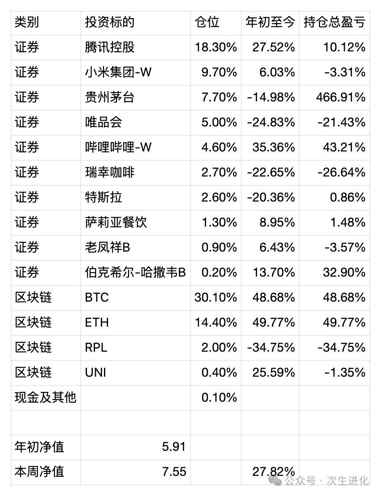

# 

# 投资需要学习什么知识？——2024年半年报

朝闻道家庭投资基金2024年上半年收益率约28%，作为参照，该基金2016～2023年的年化收益约25%。

今年的主要浮盈来自于BTC，ETH和腾讯控股以及哔哩哔哩，其中前三个标的本来就是仓位最重的，而且持有时间也很长了，主要浮亏则来自贵州茅台、唯品会、瑞幸咖啡。以全球视野而言，目前的中国资产占比似乎过高，半年报前，基于这个思考初步调整了仓位，清理了一些小仓位的中国资产，买入了特斯拉。

最近我家小朋友表现出对股票有一定的兴趣，然后我就去思考如果要教会一个人投资，应该去教什么，或者说一个人学习投资应该学习什么。这门学问看起来门槛很低，但实际上又难以像一般的学科那样可以通过学院派的教学来入门和提高。

可能最需要学习一点会计和财务知识，能在复杂的财报数据中剔除危险，发掘机会。但只有这些是不够的，要不然会计就会是最好的投资者，但现实不是如此。为了会计计算，需要懂一点数学，但是就像巴菲特说的，小学数学就够了，像牛顿那样的大数学家，投资也会亏到血本无归。

可能需要懂一些企业经营的知识，有企业经营的经验就更好，但是我们也会发现很多好的投资者并没有经营过企业，还有很多企业家在股票市场表现不佳，甚至公司高管对自己企业的股价也难以建立正确的认知。更何况如果要先学会企业经营再去投资，对大多数人来说这个要求不太现实。

可能需要懂一些经济学的知识，对宏观经济数据有一定的敏感性，但实际上看来，这些知识似乎也作用不大，一个明显的例证就是很多经济学家去搞投资，并不比韭菜散户好多少。

可能需要懂一些心理学的知识，知道市场先生是如何疯狂出价的，知道人类的不理性可能带来的危害和机会，知道恐惧和贪婪，知道逆向思考，但这些也远远不够，实际上逆市场而行大部分时候都是错误的。

说到底，投资尤其是二级市场投资，有两重的不确定性和复杂性，首先企业的经营有不确定性和复杂性，其次市场对企业的认知有不确定性和复杂性。

企业经营涉及人类的生产和消费，而市场观点本身就是由不同的人组成的，投资最终是一门关于人的学问。人类行为有理性的成分，也有非理性的成分，所以一切学问在投资面前，都力有不逮。

最终，一个好的投资人，只能把自己变成一个行走的书架，思考的永动机，像查理·芒格说的那样，去建立各种各样的思维模型，成为一个杂学家，从不同的角度去思考去决策，持续追求更高的胜率和更高的赔率，让时间和好运越来越站在自己这边。

所以说，专才教育不太可能培养出好的投资人，而只有通才教育才行。但什么都去学一点，又有变成一个夸夸其谈的人的风险，要减少这种风险，只有持续学习，穿透知识的本质去学习，慢慢形成一种质的直觉，最后才能巴菲特一样，对一个企业五分钟就能做出是否值得投资的结论。

近期操作：

1. 清仓斗鱼，持仓时间半年多，收益率约37%，清仓理由，简化持仓，买入更有吸引力的标的；
2. 清仓虎牙，持仓时间半年多，收益率约21%，清仓理由，简化持仓，买入更有吸引力的标的；
3. 清仓拼多多，持仓时间半年多，收益率约4%，清仓理由，简化持仓，买入更有吸引力的标的，对该公司的法律风险疑虑难以解除；
4. 清仓阜丰集团，持仓时间半年多，收益率约8%，清仓理由，简化持仓，买入更有吸引力的标的；
5. 小幅加仓唯品会，加仓理由，认为近期唯品会的下跌找不到合理的利空，其估值在下跌前就是偏低的，跌完就更低了；
6. 新建仓特斯拉，建仓理由，认为特斯拉是一个AI企业，而不仅仅是新能源车企，如果特斯拉能在财务上落实它是一个AI企业，或者仅仅市场给出这种预期，股价将会有10倍的上升空间；
7. 新建仓萨莉亚餐饮，这是一个买日股的试验，身处广州对这家企业有比较直观的认知，对其现金流做了比较详细的分析后，发现它的估值相比肯德基和麦当劳并不高，而且该公司刚在广州买了一块地准备建工厂，有在中国加速扩张的可能；
8. 提取部分现金，用于消费。

最新持仓情况 统计时间 20240630

