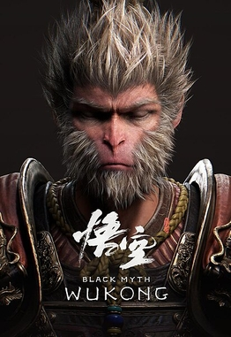
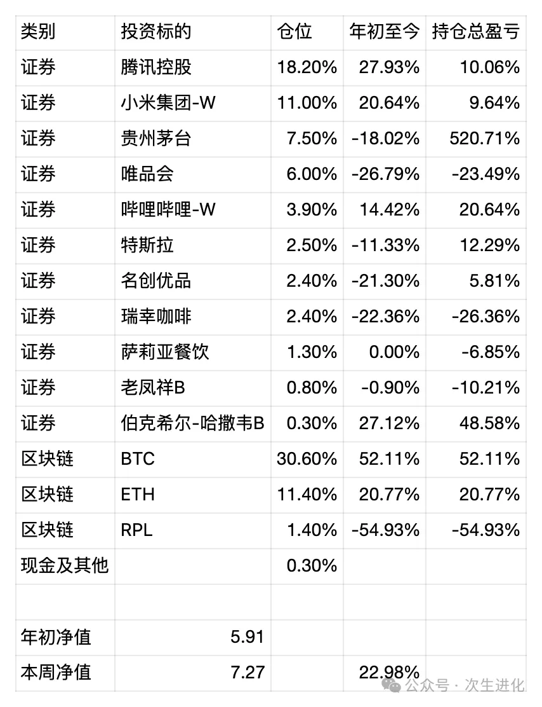

# 游戏产业的价值是什么？——周报20240825

最近国产游戏3A大作《黑神话悟空》火出圈了，甚至导致二手PS5都涨价了，因为很多平时不怎么玩游戏的人也来尝试了。但近期发布财报的腾讯和网易的股价则都没有起色，尤其是网易，股价跌到市盈率TTM只有13了。我想这种估值水平，可能是因为国内外的投资人都在思考一个问题，游戏产业和教培产业的区别在哪里？电子鸦片和文化产业、国家软实力的界线在哪里？

我的基本判断是，在中国的国家政策上，游戏产业将和逐渐和影视产业一样，成为文化产业的一部分，它和教培行业的最大区别在于，教培行业是逆人性的，影响教育公平的，而游戏则是顺人性的，它的问题只在于政策制定者和玩游戏的主流人群之间的代沟，或者说只取决于游戏玩家和无能家长之间力量的对比变化。

什么是赚钱，什么是经济发展，什么是GDP，本质上是产品和服务满足了人的需求，先有需求，后有产业。当人人都能吃饱饭后，再问“整天搞这些能有什么用？能当饭吃么？”，就会显得很可笑。

近期操作：

1. 注入部分现金；
2. 再次建仓名创优品到2～3%的仓位，看好其国内部分利润仍有增长空间（利润率估计会下降）以及出海部分仍有高增长，当前价位，股息率4.6%，市盈率TTM约20，接近一年以来的最低股价。
3. 小额减仓瑞幸咖啡与特斯拉，小额减仓ETH，清仓UNI，所得现金加仓唯品会，应对Q2财报过后的大跌约20%，认为市场反应过度，加仓后已回升约15%。

最新持仓情况 统计时间 20240825

