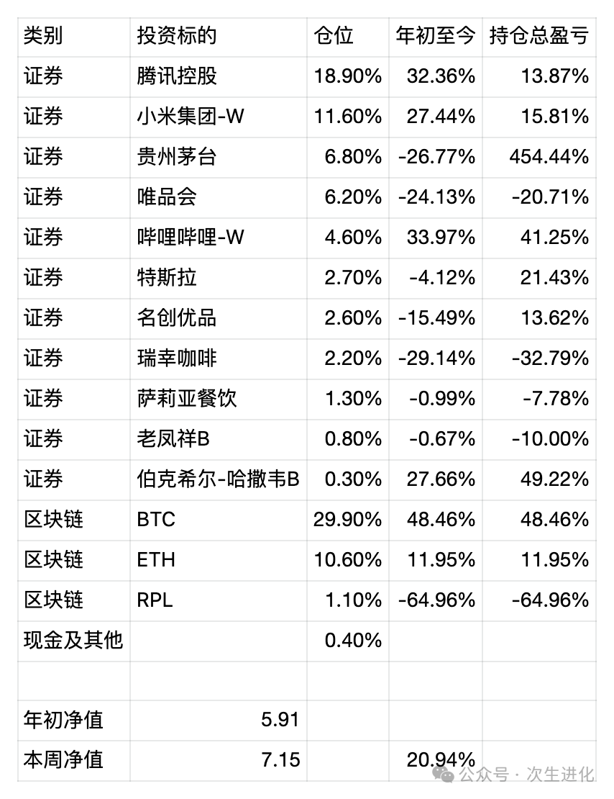

# 

# 直觉投资者、被动投资者和主动投资者——周报20240922

有三种投资者，直觉投资者、被动投资者和主动投资者，我们要么简单点，做被动投资者，要么积极点，做主动投资者，而最好不要自负地当直觉投资者。

直觉投资者，顾名思义，就是凭感觉投资，不经过分析，或者说只经过一些伪分析，可能A股大部分投资者都属于这个行列。一些典型的行为包括但不限于：听某某老师说，最近什么板块比较火，可以炒作一把；看股票名字买入一只股票，但完全不知道这家公司是干什么的；觉得新能源是未来的趋势，所以买入新能源基金，但对基金实际的持仓一无所知，甚至可能没有持有新能源的股票。

被动投资者，是一类大智若愚的人，他们知道自己很难打败市场，无法预测市场的涨跌，更无法预测单只股票的股价，转而通过分散投资分散风险，通过定投放弃择时，典型的就是定投宽指数基金，比如沪深300，标普500，纳斯达克，红利指数等等，如果只买入一个国家的指数，那么还存在赌国运的成分，而如果全球化的买入各个国家的指数，则只存在一个“赌球运”的成分，就是你是否相信这个地球上的人类社会会越来越好，只要相信这一点，宽指数基金代表了人类的优秀企业，必然有高出平均的社会生产增速的成长。

主动投资者，则是一个积极的投资者的最终形态，他们需要成为一个研究者，在自己的能力范围内彻底研究投资标的，并不断扩大自己的能力范围，相比被动投资者，他们更具进取心的地方在于，他们要去寻找市场定价错误，因此赚取更多的超额收益。然而主动投资可能是一场一厢情愿和自以为是，最后依然靠直觉。一般来说，多研究总比不研究好，但是，如果过于相信自己的研究，可能比被动投资者陷入更大的危险。这时候，他们依然要借助于分散投资，可是如果投资过于分散，其实和买指数基金区别不大。

总之，投资是一件需要谦虚谨慎的事情，需要多多验证思考自己的成功和失败是因为运气，还是真的掌握了一定的规律。从承认自己无知，获取市场平均收益出发，小心翼翼的去获取更多的收益，几乎所有自负的投资者，在长时间的市场起落中，都会付出代价。

近期无任何操作，净值略有下滑。

最新持仓情况 统计时间 20240922

