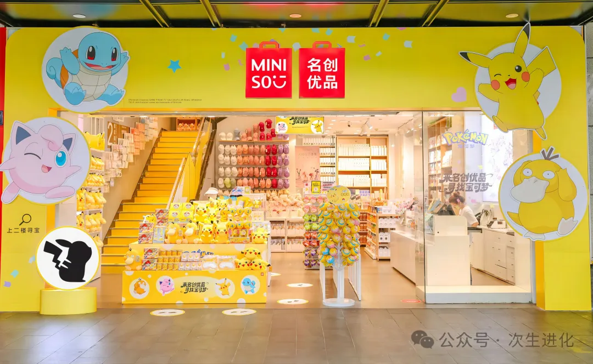
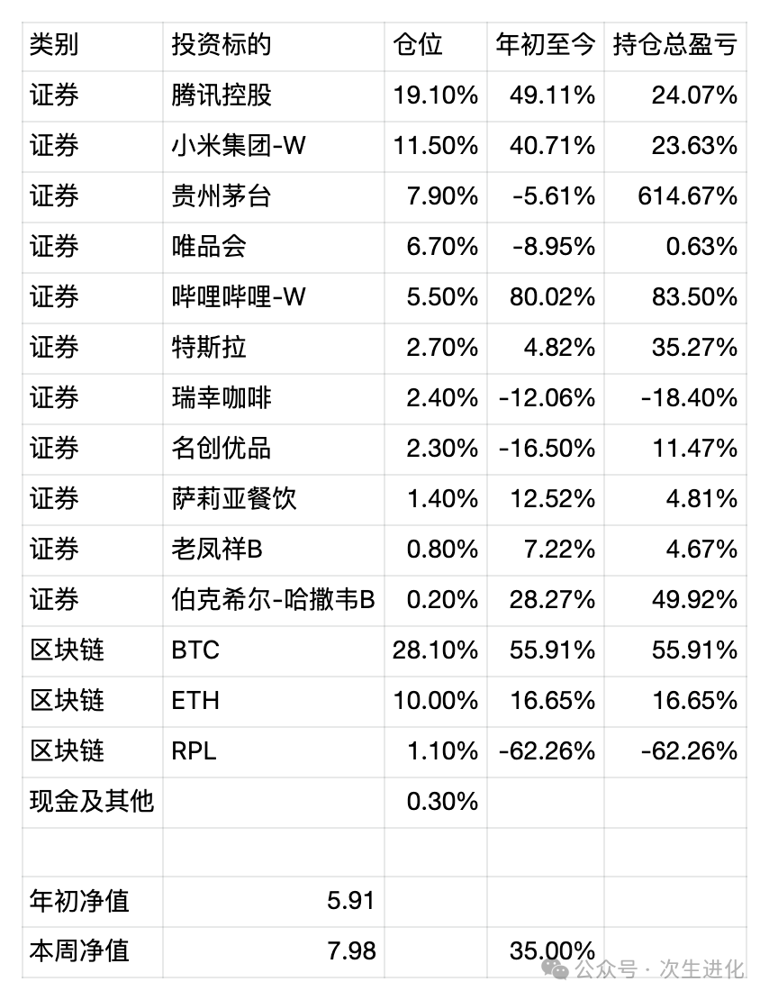

# 

# 从名创优品收购永辉超市聊企业家精神——周报20240929

对比本周和上周持仓表中的名创优品，浮盈从13.62%略微下滑到11.47%，看起来变化不大。然而在9月24日周二，当日最高暴跌40%，收盘也浮亏25%左右，当天我看到股价的时候，以为自己看错了，仔细看了下，又去搜了下新闻，才知道名创优品收购了永辉超市大股东的股权，似乎投资者们都不看好这个交易，用脚投票了，前一夜的美股跌了十来个点，我一向懒得天天看行情，也不知道，第二天才发现，隔日的港股市场更夸张，一度暴跌40个点。

说实话看到暴跌总是难受的，当时我有三个选择，一是跟风割肉，二是持股不动，三是趁机加仓。最后我选择了持股不动，现在开后视镜来看，不是最优的选择，但也是个不错的选择。

其实本来投名创优品是一个确定性还不错的选择，虽然它国内发展疲软，但国际扩张有条不紊，当时的买入价感觉还不错。但是叶国富这么一折腾，一下子逻辑变了，有了些风险投资的意味，因为名创优品能否整合好永辉超市，是一个大写的未知数。

这又让我想到了当时雷军宣布小米造车的时候，资本市场一点也不看好，我倒是对他很有信心，最后事实证明了我的眼光不错，但是也拿着小米股票陪着雷军熬了几年，很多时候，逻辑是对的还不够，关键是时机，如果要等待的时间太长，会输掉投资的时间成本。

这一次，我对叶国富的信心不如对雷军，但是从逆向投资的角度来看，也许现在确实是抄底实体零售的一个不错的时机，叶国富把十元店开进了巴黎香街，也许能再创造一次奇迹呢。

在对一些看似希望不大的机会的把握上，企业家和投资者会有本质的区别，企业家的野心，或者说企业家精神，会让他们去做一些看起来不可能的事情，旁人看起来都是荆棘，企业家却能看到机会。而投资者则更喜欢稳定的可靠的回报，股神巴菲特从来没买过什么让人觉得很酷的股票，现在持有苹果，也是在看起来有些无聊的库克掌舵之后，而不是乔布斯时期，苹果看起来不那么酷了，但回报惊人。

我个人的投资思路是，会把大部分仓位放在成熟的企业上，追求稳定的回报，比如腾讯控股和贵州茅台，如果我们在市场发疯的过程中找到合适的买卖点，甚至还能创造很不错的超额收益；把小部分的仓位放在仍在披荆斩棘的企业上，比如造车的小米，也包括当下的名创优品，个人投资者不能做风险投资，但实际上二级市场也有这样的机会，你可以当雷军和叶国富的投资人或者说合伙人。

本周名创优品的股价回升只是赶上了汹涌澎湃的做多中国资产的浪潮，并不代表我做出了正确的决策。然而投资就是这样，你会因为另外的逻辑实现你最初的目标，而你坚信的逻辑，可能只是在贪婪与恐惧中给了你一个支点而已。

本周无任何操作，所有中国资产都大涨，基金净值再次接近历史最高。

最新持仓情况 统计时间 20240922

