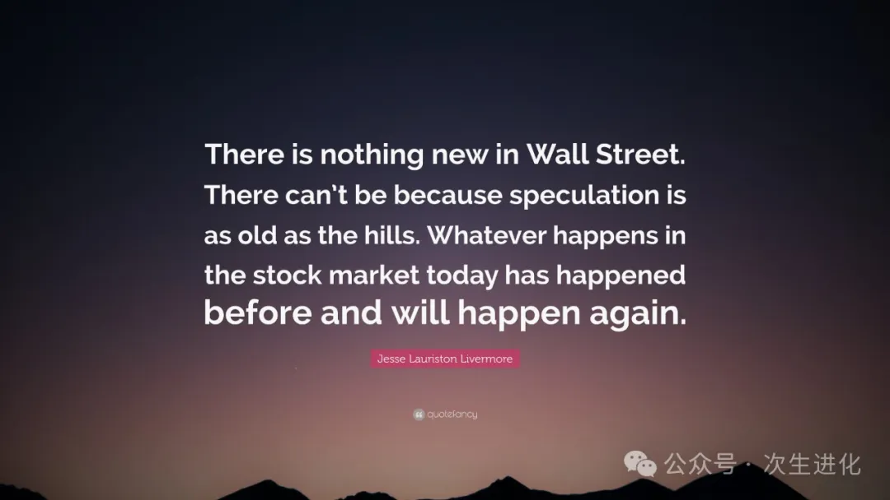
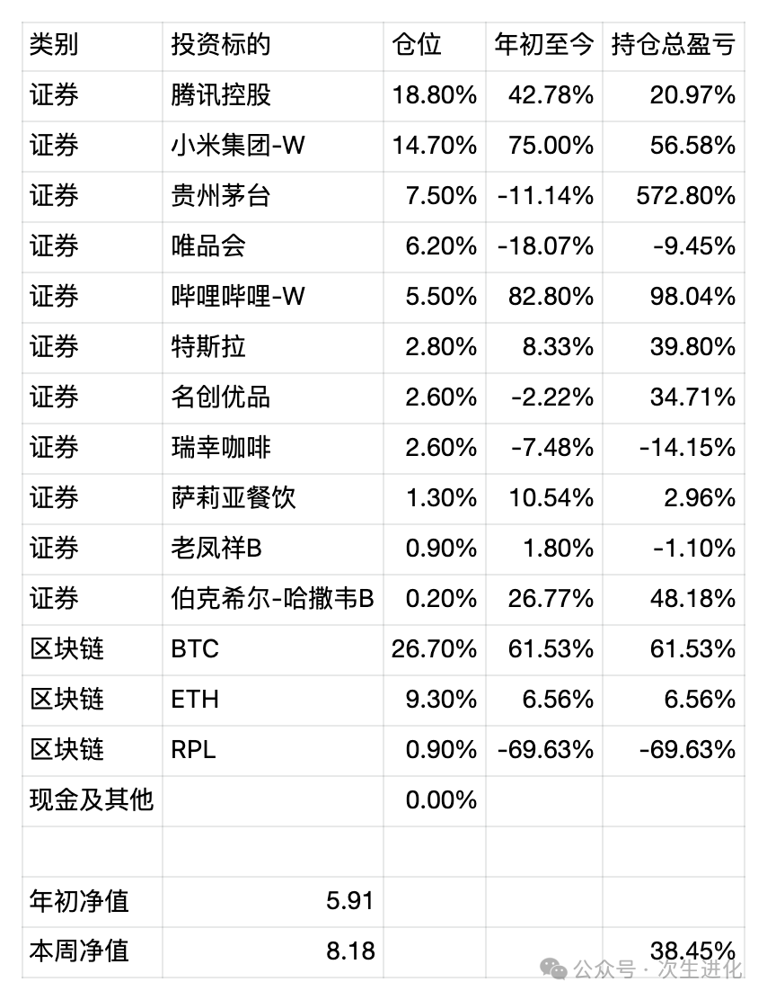

# 

# 牛市与赌场——周报20241103

最近在雪球上面逛的时候，明显发现讨论牛市是否真的来了的帖子越来越多，周末和长辈视频聊天的时候，也会被问及，听说最近是牛市？我的基本看法是：从市场情绪来看，现在确实是牛市了，但是这种市场情绪能支撑指数涨到多高，是否真的会有基本面的支撑，又是否会有过热后的崩溃**，如果有崩溃什么时候来，几乎没法判断。**

实际上，我认为作为一个严肃的投资者，尤其是偏向价值投资风格的投资者，对牛市不应该有任何期待，虽然有时候也可以利用一下牛市的市场情绪。

牛市给价值投资者的，往往是一种歪打正着。价值投资者在市场交易萧条时，按照自己内心的估值，低价格买入好公司好股票，在最萧条的时候，市场的交易者，除了坚定的价值投资者，可能就只有公司的回购。一个股票的价值被发现的过程，在熊市中是很缓慢的，其市值完全是被其真实盈利能力推高的，而市盈率不起任何作用。而当牛市来临时，所有的股票，不管是垃圾股还是绩优股，都可能因为一些莫名其妙的原因引来一堆的买入者，对于价值投资者来说，他们买入股票，一般期待的盈利都至少是翻倍，不会因为一二十个点的收益而“落袋为安”，所以从熊市中走过来的价值股，其卖盘是很少的，卖少买多，这样就可能导致牛市来临时，价值股的股价有时候会暴涨，这种情况，你很难讲这是一个真实的价值发现过程，对价值投资者而言，缓慢的价值发现过程，每年10～20个点的收益也是可以接受的，暴涨反而打乱节奏，逼迫人做出新的决策。

牛市中，会出现数不清的造富神话，人人都是股神，会有人说，巴菲特的年化**收益，我一天就拿到了。**我觉得熊市的时候，股市更像股市，剔除了流动性溢价之后，能看到真实情况，而牛市来临的时候，尤其是A股这种不成熟的市场，更像是一个赌场。**一个理性的人，不会羡慕昨天在澳门赌场赢钱的人，因为他知道，一旦参与这个游戏，赢的钱迟早也会还回去。**但是在股市里人的心态又有点不一样，它会加上很多技术分析，基本面分析，让人误以为自己不是在赌博，无论是谁，投资的还是投机的，都在同一个市场交易，让人误以为大家玩的是同一个游戏。只要记住，同一个市场，不同的游戏，你就会对别人的发财故事敬而远之。

这个世界上也许有成功的赌徒，但是如果你没有做好一个当赌徒的心理准备，那么牛市来临时，千万不要兴奋，去参与那些猜大小的赌博游戏，比如是“川大智胜”还是“哈尔斯”。如果熊市时没有买基金股票，牛市时就更加不要买了，赚点货币基金的无风险收益，不做那个发财梦，也挺好的。不过我也知道，没有人会愿意听这种扫兴的话，毕竟，**投机像山岳一般古老，太阳底下没有新鲜事，从前的发生的事，将来必定还会发生。

回归公司基本面，在必要的时候，可以利用市场情绪，仅此而已。

由于小米和BTC等持仓的缓慢复苏，基金净值突破历史来到8以上。

近期操作：

出于家庭资金安排原因，卖出少量B站和名创优品，总体上依然看好这两家公司，但认为要给出合理的估值比较困难，所以优先减持。

最新持仓情况 统计时间 20241103

