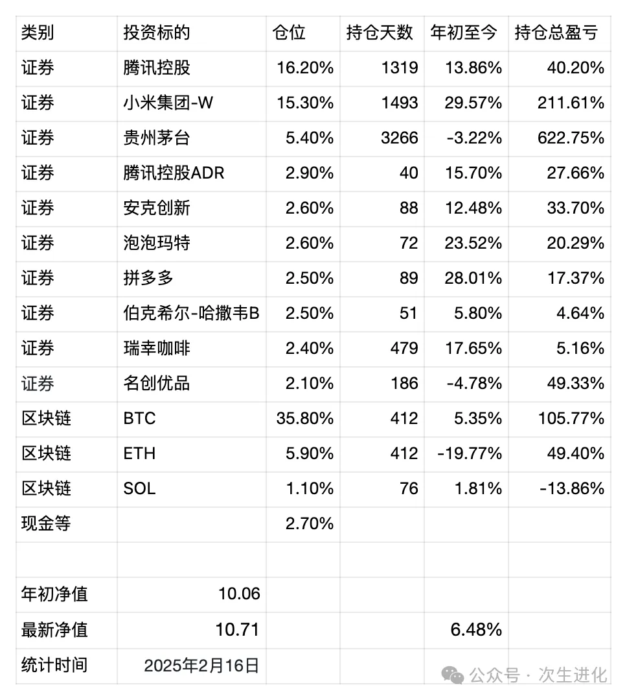

# 

# 关于大S去世后讨论的思考——朝闻道家庭投资基金周报20250216

大S去世是春节期间颇让我感到唏嘘的新闻，刻意的去了解了在各个社交媒体上关注的人对此事的看法，由此产生了一些思考，与事情的是非无关，但可能与投资有关。

1. 有一个大学理科教授在微博上说：为什么我要在微博上看到如此多关于此事的讨论，简直是污染视线。讲八卦，听故事是最深刻的人性，在信息时代之前，八卦只限于小圈子讨论身边熟悉的人，在信息时代，大明星是大家共同熟悉的，具备了大圈层乃至全民讨论的可能。
2. 附着在八卦和故事之上的，从来就有价值观，我关注的一些颇有见地的知识分子，在此事上观点大相径庭，仔细推敲一下，可能与他们的成长经历是息息相关的，人们总是愿意看到、能够看到自己更熟悉的侧面，人们总是有了自己的观点之后，倾向于去寻找支撑自己观点的论据，理智一点的会寻找事实论据，不理智的连谣言证据也照单全收。
3. 一个台湾人，和一个北京人结婚生子离婚，然后找回韩国的初恋二婚，去日本过农历新年时因病去世，然后是在高中和大学看台湾偶像剧、台湾综艺长大的大陆人在热烈讨论此事，而对他们的孩子们来说，这一切可能都毫无意义，这或许是无意之中的二战后东亚发展史的一个隐喻。
4. 我们可以有自己的观点，但对别人的观点，一定要尝试去理解，想想他们为什么会那样想，为什么有人会愿意相信那样的谣言，为什么有人又会对某些基本的常识视而不见。在任何事情上针锋相对的观点背后，根植的是同样的人性，同样的原理，不要用意识形态禁锢自己的思考。

近期操作：

1. 清仓唯品会，卖出价13.08～13.20美元，持仓时间约1年半，亏损约25%。切换为腾讯ADR，买入价47.31～49.06美金。
   交易理由：腾讯控股被美国国防部加入黑名单，短期内股价承压，我们判断并无长期影响，因此做一个中短期的调仓，超配腾讯。唯品会比较鸡肋，中短期内看不到股价启动的迹象。
2. 清仓特斯拉，卖出价350.99美金，持仓时间约半年，盈利约100%。
   交易理由：投资特斯拉的理由是就是投资马斯克，马斯克对当前的美国政治介入过深，如果比照中国历史，可能类似商鞅、王安石、张居正，其主要精力不在特斯拉这家公司上，风险规避。

最新持仓情况 统计时间 20250216

